# **導入・プレイガイド**
※注意：本ガイドは簡易版です。記載内容に誤りや不明瞭な点を発見された場合は、作者までご連絡ください。
## 事前準備

1. **重要**：
   BVE Trainsim をこれまで一度も触ったことがない方は、ウェブ上で初心者向けのガイドを検索しておすすめします。
2. Windowsの基本操作（ファイル／フォルダのコピー・移動、テキストファイルの編集と保存、ZIPの解凍など）に不慣れな方は、**まずPCの基礎操作を学んでから GSR の導入を検討することを強く推奨します。**
---
## インストール
### BVE Trainsim 本体の導入

[BVE Trainsim](https://bvets.net/jp/download/)の詳細なインストール方法については、初心者向けのガイドなどを参照してください。
ここでは特に注意すべき点のみ記載します。
1. BVE Trainsim は **Windows 専用ソフト**です。
   他のOSでも特殊な方法で動作させることは可能ですが、手順が非常に複雑なため、本ガイドの対象外とします。
2. GSRシナリオは、**BVE 5.8** にて正常動作を確認しています。
   それ以外のバージョンでは、予期しない不具合が発生する可能性があります。
---
## GSR 路線パッケージの導入
### 1. 手動導入

1. プロジェクトの GitHub リポジトリ右側にある **Releases** から、最新版の路線パッケージをダウンロードし、解凍してください。

   ※リポジトリ内のファイルは開発用であり、そのままでは正常に動作しない可能性があります。
   また、配布版にも全素材・全リソースは含まれていません。
   開発版を使用したい場合は、別途開発者向けドキュメントを参照してください。

2. `GSR\Timetables` フォルダ内には、フォルダ名の前後に「++」が付いたディレクトリが存在します
   （現時点では `1-Gensokyo Loop Line Clockwise` のみ）。

   その中にある `121M-ATSP+SN_A&C.txt` のような txt ファイルが、BVE における **シナリオ（運転ダイヤ）** です。
   ※ファイル名の意味については後述します。

3. BVE の「シナリオ選択（シナリオの選択）」画面で
   `GSR\Timetables\++ 1-Gensokyo Loop Line Clockwise ++`
   を開くと、環状線の全シナリオが表示されます。

### 2. 自動導入および継続的アップデート（予定）

※現在計画中です。

## 列車データの導入

GSR 路線を導入すると、すべてのシナリオは BVE 上に表示されますが、
初期状態では **路線付属のデフォルト車両（E127系）** が使用されます。

よりリアルな運転体験を得るためには、各作者が制作した列車データを別途導入する必要があります。

---

### デフォルト車両（E127系）が使用可能なシナリオ

他の列車データを導入しない場合でも、以下のシナリオでは E127 系での運転が可能です。

| 列車番号 | シナリオファイル名   |
| -------- | -------------------- |
| 15M      | なし                 |
| 101M     | 101M-ATSsn_N&A&C.txt |
| 121M     | 121M-ATSsn_N&A&C.txt |
| 127M     | 127M-ATSsn_N&A&C.txt |

使用しないシナリオについては、
`Vehicle =` 行の先頭に **セミコロン（;）** を付けることでコメントアウトでき、
BVE のシナリオ選択画面に表示されなくなります。

## 適切な列車の選択

GSRシナリオでは、路線付属の E127 系以外にも、
**信号プラグインの違いに対応した複数のシナリオ** が用意されています。
プレイヤーは、路線設定および自身の好みに応じて、適切な列車データを選択できます。

---

### 路線設定

現在の GSR 環状線の主な仕様は以下の通りです。

* 軌間：1067mm
* 最高速度：120km/h
* 電化方式：直流 1.5kV 架空電車線方式

使用されている信号・保安装置は以下の通りです。

* ATS-P
  （博麗神社 ～ 人間の里 ～ 守矢神社 間）
* ATS-SN（全線）
* ATS-Ps（121M シナリオのみ）

編成条件は次の通りです。

* 特急列車：6両編成以下（120m 以下）
* 普通・快速列車：4両編成以下（80m 以下）
* 風神の湖駅・霧の湖駅に停車する場合：**3両編成以下（60m 以下）**

---

### 信号プラグインについて

BVE では、同じ ATS 方式であっても、
作者や仕様の異なる **複数の信号プラグイン** が存在します。

GSR 路線で使用されている主なプラグインは以下の通りです。

| プラグイン名               | GSR 内での略称 |
| -------------------------- | -------------- |
| 汎用 ATS プラグイン        | Notsuki        |
| ask&CT 製 ATS-P プラグイン | ask&CT（A&C）  |
| Rock_On 製 snp.dll         | snp            |
| Rock_On 製 swp2.dll        | swp2           |

* 「**N&A&C**」
  → Notsuki および ask&CT の両方に対応した列車が使用可能
* 「**NoSC**」
  → 速度照査なし。ATS-S 対応列車であれば使用可能

列車がどのプラグインを使用しているかの確認方法は、後述します。

---

### 動作確認済みの列車データ

導入時のトラブルを避けたい場合、
以下はシナリオのテスト時に使用され、**安定動作が確認されている列車データ** です。
（各列車の詳細については、配布元サイトをご参照ください）

| 列車番号＼信号方式 | ATS-P/Ps（Ask）                                               | ATS-P/SN（Ask&CT）                                            | snp                                                    | swp2                                                                 |
| ------------------ | ------------------------------------------------------------- | ------------------------------------------------------------- | ------------------------------------------------------ | -------------------------------------------------------------------- |
| 15M                | -                                                             | [E653系](https://miso-yk.wixsite.com/ci19/e653)               | -                                                      | [283系](https://a43.jimdofree.com/bve-trainsim/283%E7%B3%BB/)/381系¹ |
| 101M               | -                                                             | [E129系](https://mc1323bve.blogspot.com/2020/03/jr-e129.html) | [211系](https://sigf.sakura.ne.jp/bve_211.html)        | [221系](https://mudamc22078.blog.fc2.com/blog-entry-296.html)        |
| 121M               | [E129系](https://mc1323bve.blogspot.com/2020/03/jr-e129.html) | [E129系](https://mc1323bve.blogspot.com/2020/03/jr-e129.html) | [211系](https://sigf.sakura.ne.jp/bve_211.html)/115系² | [221系](https://mudamc22078.blog.fc2.com/blog-entry-296.html)        |
| 127M               | -                                                             | [E129系](https://mc1323bve.blogspot.com/2020/03/jr-e129.html) | [211系](https://sigf.sakura.ne.jp/bve_211.html)/115系² | [221系](https://mudamc22078.blog.fc2.com/blog-entry-296.html)        |

¹ JRTrainPack 内
`Rock_On\Train\JR\Formation\hine\D601.txt`

² JRTrainPack 内
`Rock_On\Train\JR\Formation\tota\M33_3.txt`

なお、過去には [EF81 形電気機関車](http://waisroom.sakura.ne.jp/) も使用されており、
将来的に再登場する可能性があるため、リンクを残しています。

---

## 列車データを BVE に導入する
### 列車データの入手
列車データは、各作者の公式サイトにて配布されています。
ダウンロード方法は作者ごとに異なるため、ここでは詳細を省略します。

多くの場合、列車データは ZIP 等の圧縮形式で配布されているため、解凍後に使用してください。

#### JRTrainPack について

[JRTrainPack](https://mikangogo.github.io/posts/jrtrainpack/) は、多数の列車データとプラグインを含む統合パッケージです。
GSRシナリオで使用可能な列車も多く含まれています。

---

### 使用している信号プラグインの確認方法

1. **作者の説明を確認する**
   配布ページや readme に、必要なプラグインが記載されていることが多いです。

2. **ファイル構成から判断する**
   列車フォルダ内に `ATS` 等の名称のフォルダがあり、
   その中に信号プラグイン名と一致するファイルやフォルダが存在します。

   `DetailManager.dll` がある場合は、
   `detailmodules.txt` に記載されている DLL のパスを確認してください。

---

### 列車プラグインの導入方法

#### 1. JRTrainPack内のプラグインを使用する場合

`detailmodules.txt` 内に
`../../../../Rock_On\Train\JR\Plugin\***.dll`のような記述がある場合、JRTrainPack をそのパスに合致する位置へ配置すれば動作します。

#### 2. GeneralAtsPlugin を使用する場合

`detailmodules.txt` 内に`../../../GeneralAtsPlugin\Rock_On\***.dll`のような記述がある場合、指定されたディレクトリにプラグインを配置してください。

※複数の列車で同一プラグインを使用する場合、
任意の共通ディレクトリにまとめ、
`detailmodules.txt` のパスを書き換えることも可能です。

---

### シナリオファイルで列車を変更する

1. 列車データ内にある `Vehicle.txt`（または同等のファイル）を確認し、
   使用したい列車のパスを控えておきます。

2. `GSR\Timetables\++ 1-Gensokyo Loop Line Clockwise ++`
   内のシナリオファイルを開き、
   `Vehicle =` 行に上記のパスを記述してください。

これで BVE 上で GSRシナリオを運転できます。

---

### 注意事項（BVE 5.8 以降）

BVE 5.8 では、
シナリオファイル内で指定されている`Route =`、`Vehicle =`の **いずれかのパスが不正確な場合**、そのシナリオは選択画面に表示されません。

表示されない場合は、まずこれらのパスを確認してください。
それでも解決しない場合は、Issue への報告、または作者へ連絡してください。

---

## プレイについて

### 路線情報

#### 路線図

<p align="center">
    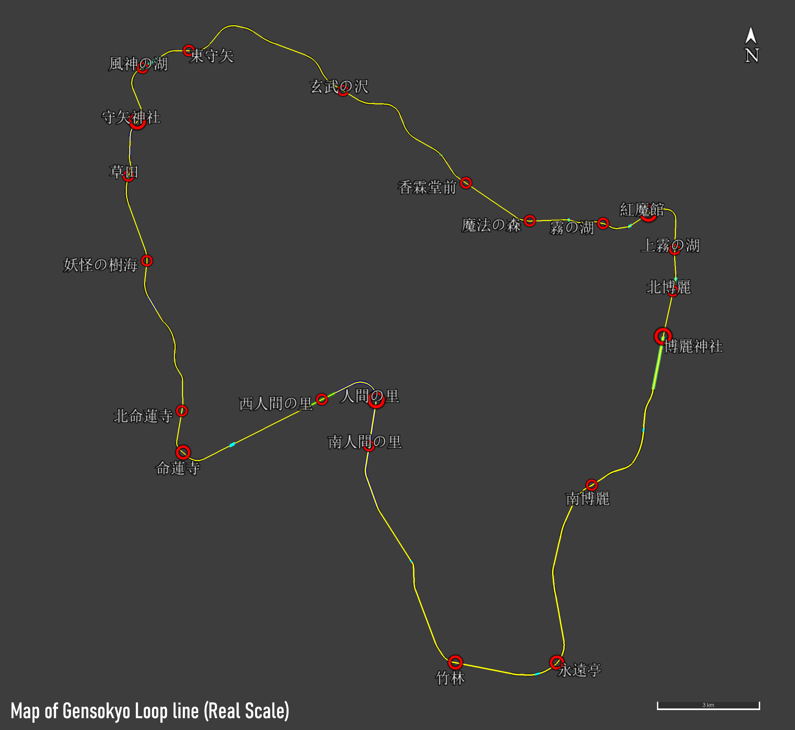
</p>

### 技術仕様

```
軌間：1067mm
最高速度：120km/h
最小曲線半径：300m
最大勾配：27.2‰
電化方式：直流1.5kV 架空電車線
信号方式：
ATS-P（博麗神社～人間の里～守矢神社）
ATS-Ps / ATS-SN（全線）
```

---

### 距離について

各駅間の距離は、作者独自の設定であり、
東方 Projectの原作とは関係ありません。
また、幻想郷の大きさに関する他者の解釈とも一致しない可能性があります。

距離は **0.01km 単位** で設定されています。
詳細は [dev.md](dev_jp.md) を参照してください。

---

## 運転可能な列車（シナリオ）

### 15M
L特急「**あゆのかぜ**」。この愛称は『東方萃夢想』中の曲名に由来します。

博麗神社を出発し、環状線を一周して再び博麗神社へ戻ります。
最高速度は 120km/h。その中の`swp2プラグイン`対応シナリオでは、高性能振り子車両（R600 +35km/h）が使用可能です。

所要時間：<br>
通常の特急車両：約56分　振り子車両使用時：約54分

※振り子機能は実験性の要素であり、カント設定の変更により傾斜を再現しています。
振り子動作は実際と異なる可能性があります。（博麗神社～南人間の里、命蓮寺～守矢神社間のみ有効）

---

### 101M
快速「もりや」。最高速度 110km/h。博麗神社～人間の里～守矢神社間のみ運転。所要時間：約35分。

---

### 121M
各駅停車の普通列車。博麗電車区を出区後、環状線を一周します。最高速度 95km/h。所要時間：約1時間24分。

---

### 127M
普通列車。博麗神社～人間の里～守矢神社間のみ運転。最高速度 95km/h。所要時間：約47分。

---

### 時刻表

※15M は **通常特急車両（非振り子）** のダイヤ。

| 駅名         | L特急あゆのかぜ 15M | 快速もりや 101M | 普通 121M | 普通 127M |
| ------------ | -------------------- | --------------- | --------- | --------- |
| 博麗神社     | 1006                 | 0937            | 0721      | 1126      |
| 南博麗       | ↓                    | ↓               | 0726      | 1131      |
| 永遠亭       | 1015                 | 0946            | 0732      | 1137      |
| 竹林         | ↓                    | ↓               | 0736      | 1140      |
| 南人間の里   | ↓                    | ↓               | 0742      | 1147      |
| 人間の里     | 1025                 | 0955            | 0747      | 1151      |
| 西人間の里   | ↓                    | 0959            | 0750      | 1155      |
| 命蓮寺       | 1031                 | 1003            | 0755      | 1200      |
| 北命蓮寺     | ↓                    | ↓               | 0757      | 1202      |
| 妖怪の樹海   | ↓                    | ↓               | 0802      | 1207      |
| 草田         | ↓                    | ↓               | 0805      | 1210      |
| 守矢神社     | 1040                 | 1012            | 0810      | 1212      |
| 風神の湖     | ↓                    | =               | 0813      | =         |
| 東守矢（信） | ↓                    |                 | ↓         |           |
| 玄武の沢     | ↓                    |                 | 0820      |           |
| 香霖堂前     | 1052                 |                 | 0825      |           |
| 魔法の森     | ↓                    |                 | 0828      |           |
| 霧の湖       | ↓                    |                 | 0832      |           |
| 紅魔館       | 1058                 |                 | 0836      |           |
| 上霧の湖     | ↓                    |                 | 0840      |           |
| 北博麗       | ↓                    |                 | 0842      |           |
| 博麗神社     | 1103                 |                 | 0845      |           |
---

## 運転操作について
BVE の基本操作については、初心者向けのガイドをご覧ください。列車データごとに操作方法や機能は異なる可能性もあります、詳細は、各列車作者が提供している説明書をご確認ください。

### 沿線の標識について

以下の画像は、GSRの路線で使用している信号機や標識の例です。画像内の数字・駅名・信号現示は一例なので、運転時には現在のシナリオ、使用車両、進路、および実際の表示を確認してください。

- **手前で減速し、列車の最後部が通過してから速度制限を解除します。** 列車の先頭が制限の開始位置に達する時点で、制限速度以下まで減速しておく必要があります。最後部が対応する解除位置を完全に通過した後で、ほかの制限が許す範囲内で加速してください。
- **複数の制限が同時に適用される場合は、最も低い速度を守ります。** 進行現示や一つの解除標識によって、適用中の曲線・勾配などの制限がすべて解除されるわけではありません。また、現在のシナリオや車両の最高速度も超えてはいけません。
- **標識の意味とキー操作は分けて理解してください。** 力行・ブレーキ・ATS確認・振り子装置の具体的な操作は車両によって異なります。使用車両の説明書に従い、ATSが作動するまでブレーキ操作を待たないでください。

#### 信号機と信号確認

| 画像 | 意味 | 運転時の操作 |
| --- | --- | --- |
| 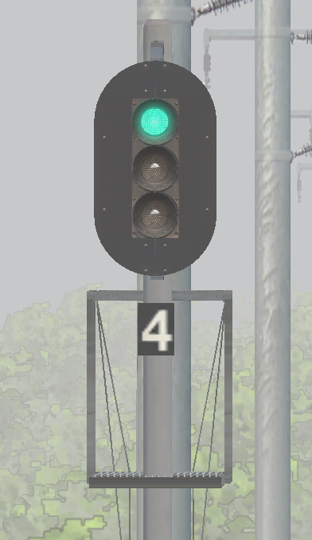 | **3灯式色灯信号機**。赤・黄・青を現示します。画像は進行現示で、下の「4」は閉そく信号機の番号です。 | 自列車の進路に対応する信号機であることを確認し、その時点の現示に従って運転します。番号は信号機を識別するためのもので、制限速度や停止位置までの距離ではありません。 |
| 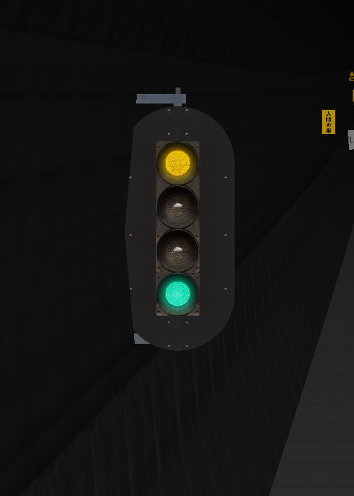 | **4灯式色灯信号機**。画像では黄と青の2灯が点灯し、「減速」を現示しています。4灯式でも種類によって黄・青や黄2灯などの現示が異なるため、灯器の数だけでは判断できません。 | 画像の黄・青の現示は、GSRでは **75 km/h以下** を意味します。手前からブレーキをかけ、信号機に達するまでに指定の速度以下に減速し、引き続き前方の信号を確認してください。 |
| 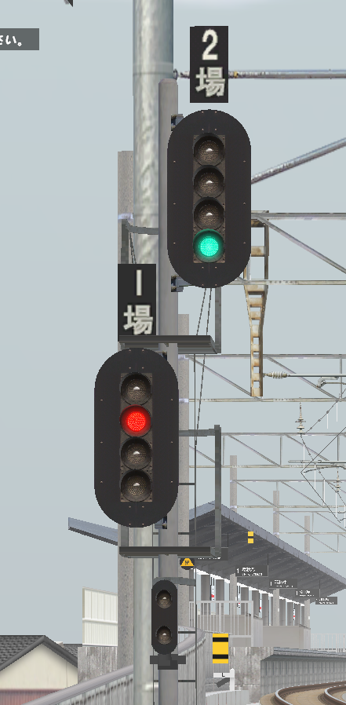 | **異なる進路に対応する場内信号機**。画像の「2場」は進行、「1場」は停止を現示し、それぞれ異なる到着進路に対応します。走行中に順番に通過する2基の信号機ではありません。 | 自列車の進路に対応する信号機を確認します。その信号機が進行を許している場合に限り通過できます。同じ柱のもう一方が進行を現示していても、自列車に対する停止現示を越えてはいけません。 |
| 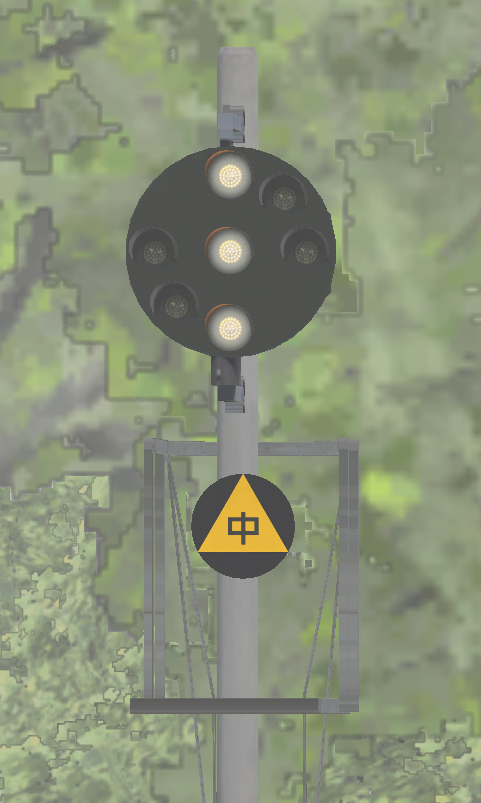 | **中継信号機**。前方の主体信号機が見通しにくい場合に、その現示を手前で中継します。白色灯3灯の縦配列が「進行中継」、斜め配列が「制限中継」、横配列が「停止中継」です。画像は進行中継です。 | 縦配列の場合は引き続き主体信号機を確認し、斜め配列の場合は前方の主体信号機の制限に応じて減速できるよう準備します。横配列の場合は、**前方の主体信号機の手前**で停止できるよう準備してください。斜め配列だけでは25・55・75 km/hのいずれかを区別できないため、主体信号機の確認が必要です。 |
| 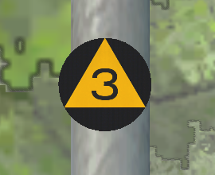 | **信号喚呼位置標**。この位置で、前方の対応する信号を確認するよう促す標識です。画像の「3」は第3閉そく信号機に対応します。中継信号機付近には「中」と書かれた同種の標識もあります。 | この位置に達したら信号現示を確認し、速度維持・減速・停止準備を判断します。制限速度3 km/h、残り3 km、または汽笛吹鳴を示す標識ではなく、通過するだけでATS確認キーを押す必要もありません。 |

GSRの現在のシナリオにおける主な信号現示と速度は次のとおりです。速度の単位はkm/hです。

| 現示 | 名称 | GSRでの運転条件 |
| --- | --- | --- |
| 赤（R） | 停止 | この信号機の手前で停止し、越えてはいけません。 |
| 黄2灯（YY） | 警戒 | 25以下で運転し、前方の停止信号の手前で停止できるよう準備します。 |
| 黄1灯（Y） | 注意 | 55以下で運転し、前方の停止信号の手前で停止できるよう準備します。 |
| 黄・青（YG） | 減速 | 75以下で運転し、引き続き前方の信号を確認します。 |
| 青（G） | 進行 | ほかの制限が許す範囲内で運転します。15Mの最高速度は120、101Mは110、121M・127Mは95です。 |

これらはGSRのシナリオ設定に基づく数値です。ほかの路線の信号による速度制限を、そのままGSRに当てはめないでください。中継信号の3種類の配列と意味については、[国土交通省「鉄道に関する技術上の基準を定める省令等の解釈基準」第117条に関する解説（本文118ページ）](https://www.mlit.go.jp/tetudo/content/20240315interpretation.pdf)も参照してください。

#### 曲線・速度制限と振り子運転

**速度制限標識の数字の単位はkm/h、曲線半径標識の単位はmです。** 複数段の速度制限標識は、現在のシナリオに適用される曲線通過速度の区分に従って読み取ってください。最も大きい数字を自由に選んだり、車両の外観や「快速／特急」という名称だけで判断したりしてはいけません。

| 画像 | 意味 | 運転時の操作 |
| --- | --- | --- |
| 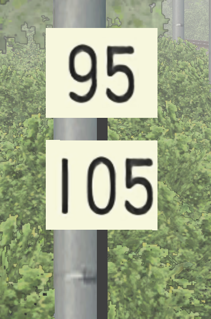 | **白地の2段の曲線速度制限標識**。画像の上段95は通常の曲線通過速度区分、下段105は曲線通過速度を引き上げた区分です。現在の101M・121M・127Mは上段、通常の非振り子15Mは下段を使用します。 | 制限の開始位置に達するまでに、対応する速度以下に減速します。例えば101Mはシナリオの最高速度が110でも、画像の曲線では95を守ります。下段の区分に適合する15Mは105で運転できますが、ほかにより低い制限があれば従ってください。 |
| 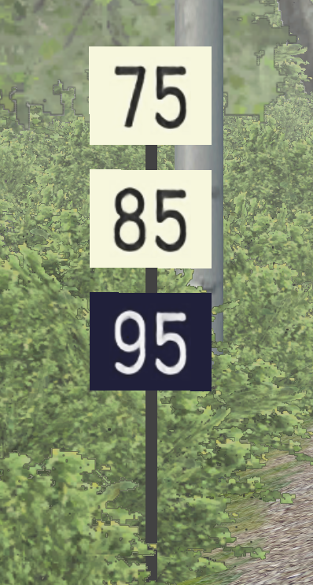 | **振り子運転用の速度を併記した曲線速度制限標識**。上の白い2枚は通常／速度引上げの曲線通過速度区分で、最下段の濃色地に白字の標識は振り子運転時の適用速度です。画像ではそれぞれ75・85・95です。 | 普通・快速のシナリオでは、濃色の標識があるからといって振り子運転用の速度を使用してはいけません。シナリオが対応し、車両が要件を満たし、その曲線で振り子運転が許可されている場合に限り、対応する振り子運転用の速度制限を適用します。**現在の15Mのswp2対応高性能振り子シナリオでは、同じ例の曲線に画像の95ではなく105が表示されます**。実際のシナリオで表示される数字を読み取ってください。 |
| 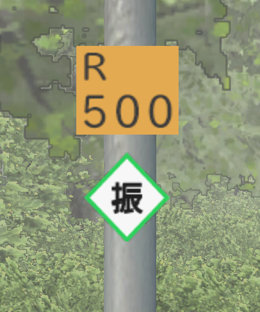 | **曲線半径予告＋振り子運転許可標識**。「R500」は前方に半径約500 m級の曲線があることを示し、緑枠の「振」はその曲線で振り子運転が許可されていることを示します。 | 前方の曲線と適用速度を早めに確認し、減速の準備をします。「500」は速度ではなく、この標識自体が数値で示された速度制限の開始位置でもありません。非振り子シナリオでは引き続きそのシナリオの速度区分に従います。 |
| 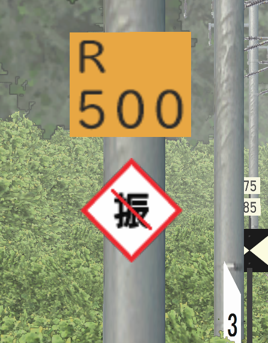 | **曲線半径予告＋振り子運転禁止標識**。赤枠内の「振」に斜線が入った標識は、前方の曲線で振り子運転を使用しないことを示します。 | 振り子車両も、振り子運転を使用しない場合の適用速度に従い、濃色標識の振り子運転用速度をそのまま適用してはいけません。現在の高性能振り子15Mでは、このような曲線で非振り子条件の速度引上げ区分を使用します。現地にさらに低い制限があれば、その値に従ってください。 |
| 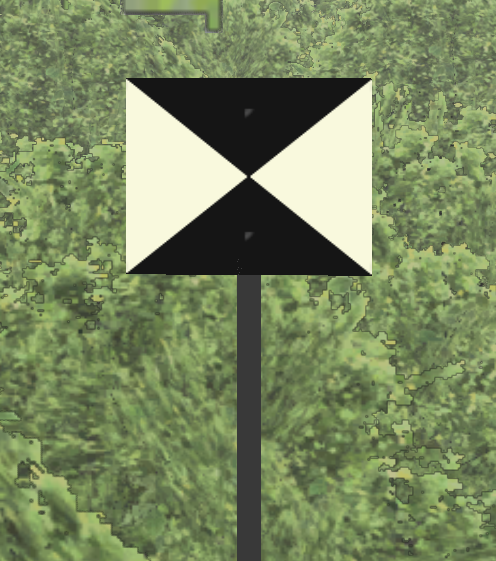 | **速度制限解除標識**。対応する速度制限区間の終端を示します。 | **列車の最後部が解除位置を完全に通過するまで**元の速度制限を守り、その後、現在の信号・シナリオの最高速度・ほかに適用中の制限を確認して加速の可否を判断します。先頭が通過した時点で直ちに元の制限速度を超えてはいけません。 |

本プロジェクトでは、現在、路線のカント設定を変えることで振り子運転を再現しています。「振」の標識を、すべての車両で同じスイッチを操作する指示と解釈しないでください。対応区間と使用できる車両は前述の15Mの説明を参照し、車両独自の操作が必要な場合は車両の説明書に従ってください。速度制限の開始位置と、最後部が解除位置を通過する際の基本操作については、[BVE内房線操作マニュアル12ページ](https://bvets.net/uchibo/Read_me%28JA%29.pdf)も参照してください。

#### 下り勾配の速度制限

青地に白字の勾配標識は、GSRの下り勾配における速度制限を知らせるものです。**矢印の下の10・15・20は下り勾配の制限区分を表し、10・15・20 km/hという意味ではありません。また、現在位置の正確な勾配を読み取るための数字でもありません。** 現在のプロジェクトでは、下表の値をシナリオの最高速度から差し引きます。曲線や信号などによる制限がさらに低い場合は、その低い制限にも従ってください。

| 下り勾配標識の数字 | シナリオの最高速度から差し引く値 | 普通121M／127M（最高95） | 快速101M（最高110） | 特急15M（最高120） |
| --- | --- | --- | --- | --- |
| 10 | 5 km/h | 90 km/h | 105 km/h | 115 km/h |
| 15 | 10 km/h | 85 km/h | 100 km/h | 110 km/h |
| 20 | 15 km/h | 80 km/h | 95 km/h | 105 km/h |

| 画像 | 意味 | 運転時の操作 |
| --- | --- | --- |
| 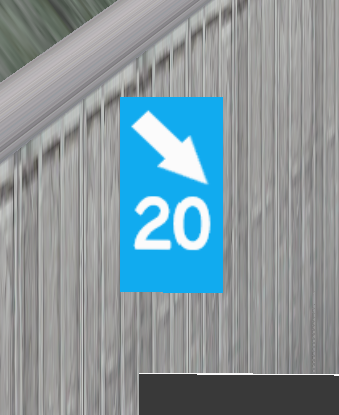 | **下り勾配の速度制限開始**。画像の「20」は上表の最下行に対応します。例えば普通シナリオでは、この場所の下り勾配による速度上限は80 km/hです。 | 制限の開始位置に達するまでに減速を終え、下り勾配では早めに力行を弱め、適切にブレーキを使って速度を保ちます。惰行中も速度が上がり続けることがあるため、力行を切っただけで速度の確認をやめてはいけません。 |
| 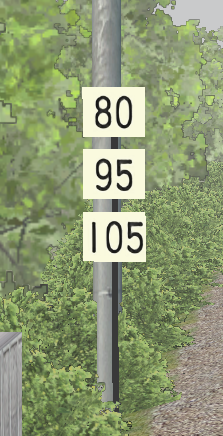 | **下り勾配と曲線の条件を合わせた複数段の速度制限標識**。この画像の3段はいずれも白地で、80は普通121M／127M、95は快速101M、105は15Mに適用します。段ごとの意味は前述の通常の2段の曲線速度制限標識とは異なり、最下段も濃色地の振り子専用標識ではありません。 | 現在のシナリオに対応する数字に従って運転します。表示された数字には、その場所の下り勾配の条件がすでに反映されているため、**80／95／105からさらに同じ値を差し引かないでください**。信号などによる、さらに低い制限には引き続き従います。 |
| 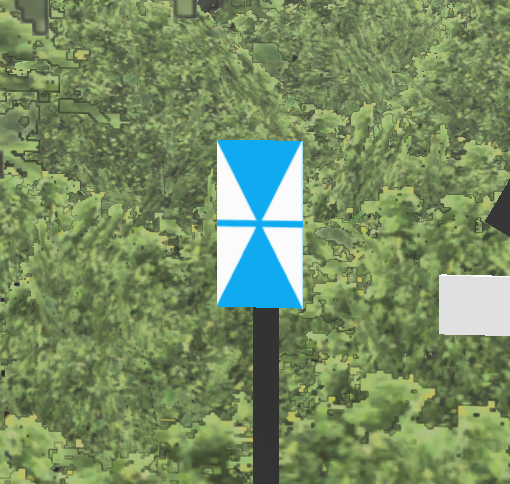 | **下り勾配の速度制限解除標識**。対応する下り勾配の付加制限を解除します。すべての速度制限が解除されるわけではありません。 | 最後部が対応する解除位置を通過した後、曲線・信号・シナリオの最高速度を改めて確認し、それらの条件が許す場合に限り加速します。下り勾配の制限が解除された後も、曲線の速度制限が続く場所があります。 |

#### 駅への接近と停止位置

まずシナリオの時刻表で、その駅に停車するか通過するかを確認してください。停止位置までの距離の目安となる標識は、減速の進み具合を把握するためのもので、ブレーキのノッチを指定するものではありません。現在の速度・勾配・車両のブレーキ性能に合わせ、余裕を持って操作してください。

| 画像 | 意味 | 運転時の操作 |
| --- | --- | --- |
| 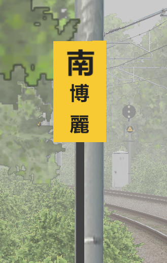 | **駅名予告標識**。画像の「南博麗」は、前方に南博麗駅があることを知らせます。 | 現在位置と停車駅を確認します。停車する場合は駅への進入に備えて減速の準備をし、通過する場合も引き続き信号と速度制限に従います。標識から停止位置までの距離は駅によって異なります。 |
| 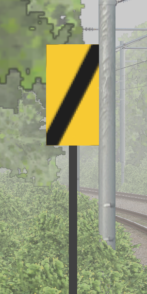 | **駅接近／停車予告標識**。黄色地の黒い斜線は、前方に駅が近づいていることを知らせます。設置位置からの距離は場所によって異なり、残り距離が一定であることを示すものではありません。 | 停車駅かどうかを再確認します。停車列車は速度と制動距離に応じて減速を開始、または継続します。通過列車は、この標識だけを理由に停止する必要はありません。黄色地に黒い横線がある100 mの距離標識とは異なります。 |
|  | **停止位置まで300 mの目安**。3本の黒い横線は、駅の基本停止基準位置まで約300 mであることを示します。 | 現在の速度と残りの制動距離を確認し、自列車の停止目標に停止できるようにします。必要に応じてブレーキを強めてください。この標識を、どの列車にも共通するブレーキ開始位置と考えてはいけません。 |
| 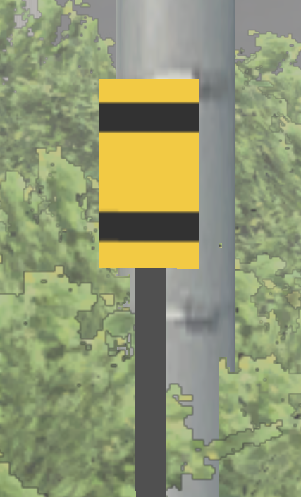 | **停止位置まで200 mの目安**。2本の黒い横線は、基本停止基準位置まで約200 mであることを示します。 | 減速を続けながら停止目標を確認し、残り距離に応じてブレーキを調整します。 |
| 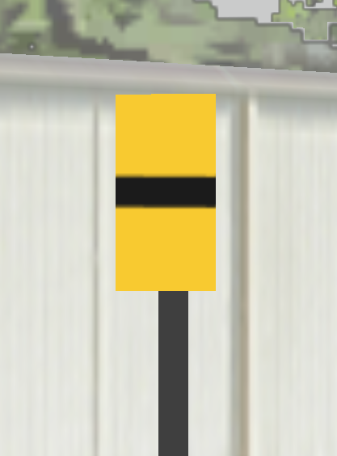 | **停止位置まで100 mの目安**。1本の黒い横線は、基本停止基準位置まで約100 mであることを示します。 | 引き続き進入速度を調整し、最後の停止位置の微調整に余裕を残します。この標識自体は停止位置ではありません。 |
| 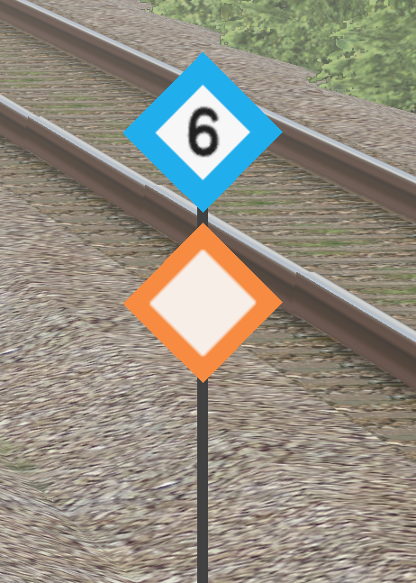 | **列車停止位置目標**。青枠の「6」は6両編成の停止目標です。橙枠で数字のない標識は、この路線の一般的な停止目標で、主要駅では普通／快速が使用する短編成の停止位置に対応します。両者は同じ位置にある場合も、前後に離れている場合もあります。 | 停車駅では、現在のシナリオに対応する目標位置に列車の先頭を合わせ、BVEの停止位置案内も確認してください。数字は編成両数であり、速度やホーム番号ではありません。色だけで列車種別を判断したり、停止位置目標を見かけるたびに停止したりしないでください。 |

**100／200／300 mの標識は駅の基本停止基準位置を基に設置されており、すべての編成の実際の停止位置に正確に対応するとは限りません。** 例えば永遠亭駅では6両編成の停止位置が4両編成の停止位置より先にありますが、距離標識は基本停止位置を基準に配置されています。最終的には、現在のシナリオの停止位置と、その編成に対応する目標に従って停車してください。

#### 勾配の変化

勾配は線路の上り下りの程度を表し、通常は **‰（パーミル、千分率）** を単位とします。例えば10‰は、水平方向に約1000 m進む間に、高さが約10 m変わることを意味します。勾配標は速度制限標識ではなく、力行やブレーキのノッチを指定するものでもありません。

| 画像 | 意味 | 運転時の操作 |
| --- | --- | --- |
| 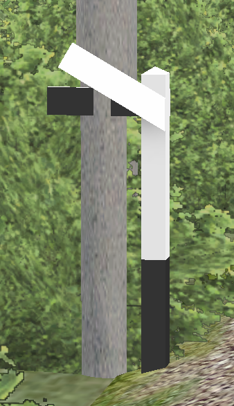 | **上り勾配標**。画像では自列車側を向いた白い腕が左上がりに傾いており、前方が上り勾配になることを示します。 | 実際の速度に応じて力行を調整し、速度が下がりすぎないようにします。前方で減速や停止が必要な場合は、上り勾配による減速への影響も考慮してください。現在の許容速度は引き続き守ります。 |
| 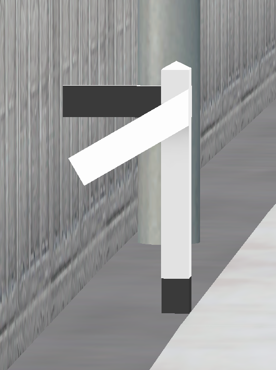 | **下り勾配標**。画像では白い腕が左下がりに傾いており、前方が下り勾配になることを示します。 | 早めに力行を弱め、必要に応じてブレーキで速度を保ち、その先の停止や速度制限に備えて制動距離を確保します。青い下り勾配の速度制限標識もある場合は、その速度制限にも従ってください。 |
| 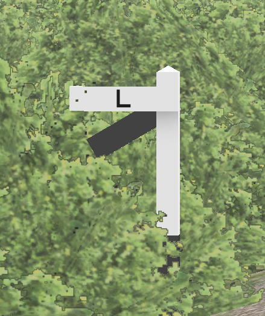 | **水平区間の勾配標**。白い腕が水平で「L」と表示され、前方が水平区間になることを示します。 | 勾配の変化に合わせて力行やブレーキを調整し直します。上り勾配での力行を続けて速度超過したり、下り勾配でのブレーキを続けて必要以上に減速したりしないようにしてください。水平区間に入っても、速度制限が解除されるわけではありません。 |
| 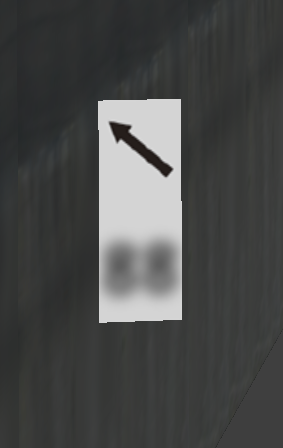 | **トンネル内の勾配標**。矢印で勾配の向きを示します。画像の左上向き矢印は上り勾配を示しています。この画像と元のテクスチャでは下の数字が不鮮明なため、具体的な勾配値は読み取れません。 | 勾配の向きと列車の速度変化に応じて操作を調整します。操作の原則は屋外の勾配標と同じです。不鮮明な数字を推測して速度制限と解釈しないでください。 |

#### キロ程とトンネル名称

| 画像 | 意味 | 運転時の操作 |
| --- | --- | --- |
| 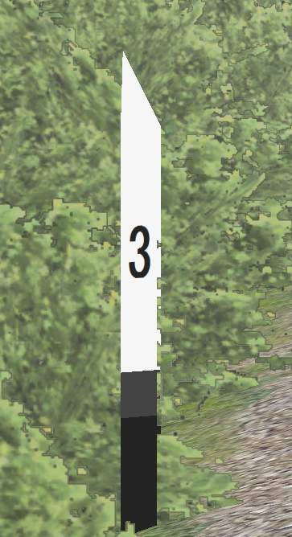 | **キロポスト**。画像の「3」は路線のキロ程3 kmを表し、線路上の位置を示します。 | 路線資料と照合して位置を確認できます。次の駅まで残り3 kmという意味ではなく、追加の減速や停止も必要ありません。 |
| 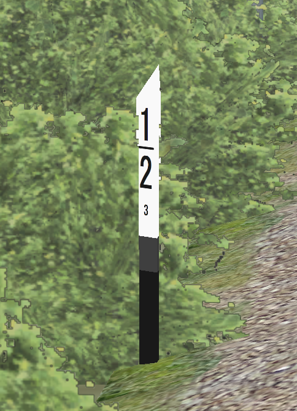 | **500 m単位の距離標**。画像の上の「1/2」と下の小さな「3」を合わせて、路線のキロ程3.5 kmを表します。 | 位置や走行の進み具合を把握するために使用します。「1/2」を次の駅まで残り500 mという意味に読み替えてはいけません。 |
| 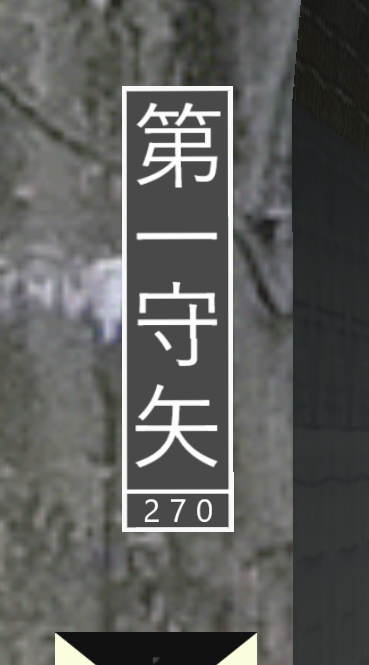 | **トンネルの名称・延長標**。画像は「第一守矢」トンネルで、下の「270」はトンネルの長さ270 mを表します。 | 前方のトンネルと現在位置を確認し、トンネル内でも引き続き信号・勾配・速度制限に注意します。名称・延長標自体は、停止・汽笛吹鳴・速度変更を指示するものではありません。 |

#### 架線のエアセクション

エアセクションは、架線のき電区間を分けるために設けられます。ここで紹介する標識は、主にパンタグラフをセクションの位置で止めないよう促すものです。電流を遮断して通過する必要がある無電区間の標識とは区別してください。[JR東日本のエアセクションに関する説明](https://www.jreast.co.jp/press/2007_1/20070609.pdf)には、本プロジェクトと同じ種類のセクション区間およびセクション外停止位置の標識が掲載されています。

| 画像 | 意味 | 運転時の操作 |
| --- | --- | --- |
| 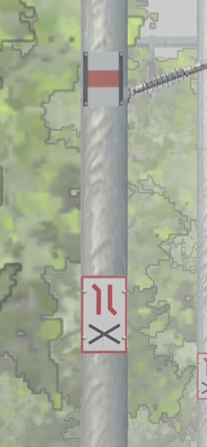 | **エアセクション区間標識**。画像の架線柱にある赤白の表示と、その下の「×」付きのセクション標識は、エアセクションのある区間を示します。この区間内での停止を避けてください。 | 前方の信号と停止可能な位置を早めに確認し、進行が許されている場合は円滑に通過して、セクション区間内に列車を止めないようにします。**この標識だけから、電流を遮断する・惰行する・パンタグラフを下げる必要があると判断してはいけません**。車両に別途操作規定がある場合は、その説明書に従ってください。 |
| 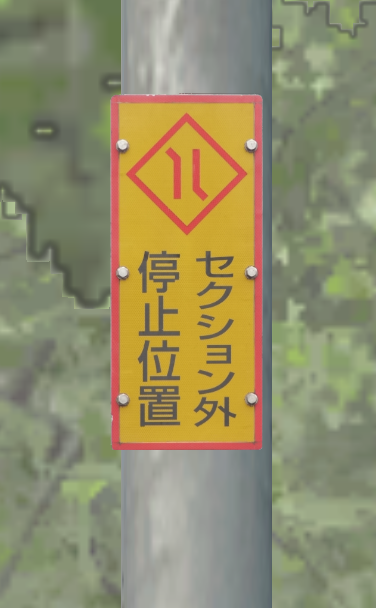 | **セクション外停止位置標**。「セクション外停止位置」は、エアセクションを避けるための停止目標を示し、付近で停止して待つ必要がある場合などに使用します。 | 前方の信号などにより停止が必要な場合は、信号が進行を許す範囲内で、対応するセクション外の停止位置を選びます。通常の走行では、ここに停止する必要はありません。この標識まで進むために停止信号を越えてはいけません。また、緊急時は直ちにブレーキをかけてください。 |
