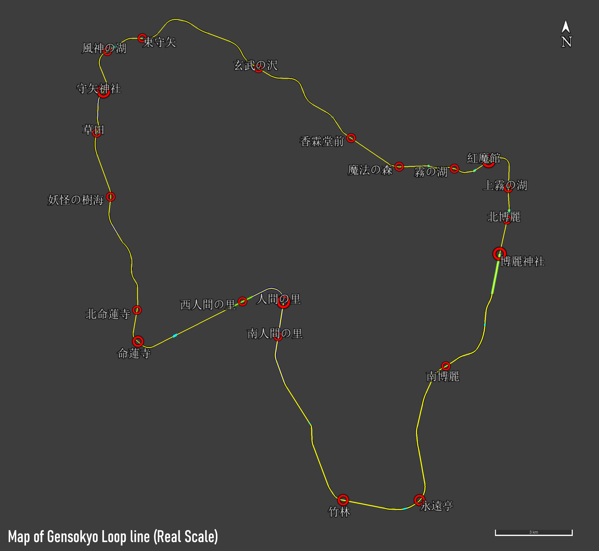

# GSR安装及游玩指南
注意：这是一个简略的指南，很多地方都没有被完善，如在文中发现任何问题（表述错误或不够清晰、详细等），请联系作者
# 准备工作
1. 重要：如果你从未接触过BVE Trainsim这款模拟软件，请先观看下面的教程<br>
[【BVE新手向教程（1）本体下载与线路下载】](https://www.bilibili.com/video/BV1se4y1A7NW/)<br>
[【BVE新手向教程（2）线路管理和版权问题】](https://www.bilibili.com/video/BV1Nd4y1H7u1/)<br>
[【BVE新手向教程（3）实操键位和部分保安装置确认方法介绍】](https://www.bilibili.com/video/BV1C8411M73X/)<br>
[【BVE新手向教程（4）番外篇】](https://www.bilibili.com/video/BV1CY411q7ia/)
2. 如果你不熟悉使用Windows系统的一些基本操作（复制和移动文件、文件夹，编辑并保存文本文件，压缩包解压等），**强烈建议你先学习一些电脑使用相关的基础知识，再来考虑安装GSR。**<br>
3. 下载列车和插件的网站有很大一部分需要“特别的技术手段”才能访问，如果你想要下载这些文件，需要学习相关的技术。<br>（注意：由于大部分作者严格的版权管理，二次分发这些数据属于违规行为，本项目作者不提供任何代为下载的服务）
4. 大部分BVE相关的资料以及网站均只有日语版本，请确保你有一定程度的日语水平，或者使用翻译工具。
# 安装
## BVE Trainsim软件的安装
[BVE Trainsim](https://bvets.net/jp/download/)的详细安装方法可在上面的“BVE新手向教程（1）”中找到，此处不再详细说明。不过还是有几个注意事项：
1. 请确保您在Windows操作系统下，BVE本体只有适配Windows的版本。
   （虽然在其它操作系统上有可能通过特殊方式运行，但是具体操作方法的复杂程度让这样的方法不属于“新手教程“的范畴。）<br>

2. GSR线路目前仅在使用BVE5.8版本的测试中完全正常运行，在使用其它BVE版本时，可能会出现未知的问题。

## 导入GSR线路包
### 1.手动导入
1. 下载项目代码仓库首页右侧“Releases”中的最新版线路包到本地，将压缩包下载到本地后解压。<br>（注意：目前代码仓库内的文件仅用于开发，可能无法在BVE中正常运行。同时发行版的线路内也不包含完整的素材库和各种资源文件。如果你有安装开发版线路的需要，请参考开发者指南）<br>

2. 在”GSR\Timetables“目录下，可以找到几个名称前后带加号“++”的文件夹（目前仅有名为1-Gensokyo Loop Line Clockwise的一个文件夹），里面有很多文件名类似“121M-ATSP+SN_A&C”的txt文件，这些文件就是BVE里的列车任务（Scenario）文件。（这里的文件名代表的意思将会在稍后讲解）
3. 在BVE的”线路选择“（シナリオの選択）界面打开“GSR\Timetables\\++ 1-Gensokyo Loop Line Clockwise ++“目录，即可看到当前版本中环状线的全部列车任务。<br>
### 2.自动导入并长期获取更新（计划中）
## 导入列车数据
在“导入GSR线路包”这个步骤完成之后，所有列车任务都会显示在BVE中，部分任务已经可以正常运行。不过此时所有任务使用的列车都是线路包中的默认列车（E127系），为了获得更好的驾驶体验，需要自行安装更多其它作者制作的列车数据。
### 默认列车（E127系）对应的任务
如果你不想安装其它列车数据，也可以只使用默认的列车驾驶。默认的列车只在一部分任务中可以正常运行，在下面的表格中写出：
| 列车番号 | 任务文件名           |
| -------- | -------------------- |
| 15M      | 无                   |
| 101M     | 101M-ATSsn_N&A&C.txt |
| 121M     | 121M-ATSsn_N&A&C.txt |
| 127M     | 127M-ATSsn_N&A&C.txt |

在没有使用的任务文件中，你可以在”Vehicle =“一栏的最开头添加分号";"（在任务文件中表示注释），这样它们将不会显示在BVE的线路选择界面中。
### 选择合适的列车
除线路内置的E127系之外，GSR线路提供了多个对应不同信号插件的任务，玩家可以自行寻找合适的列车。列车可以根据GSR线路的设定与个人喜好选择。<br>
#### 线路设定
目前GSR环状线全线的轨距为1067mm，线路最高速度120km/h，电气化方式使用DC1.5Kv的架空接触网。对应的信号系统有ATS-P（博丽神社-人间之里-守矢神社间）和ATS-SN（全线）以及ATS-Ps（只有121M任务使用）。对应的列车长度为特急列车6辆（120m）以下，普通和快速列车4辆（80m）以下，如果列车在风神之湖和雾之湖站停车，列车长度需要在3辆编成（60m）以下。
#### 信号插件
在BVE中，即使是相同的信号系统（ATS-P,ATS-SN等）也可能使用不同的信号插件进行模拟。下面是GSR线路对应的几种信号插件：

| 插件名称              | 在GSR项目中使用的简称 |
| --------------------- | --------------------- |
| 汎用ATS插件           | Notsuki               |
| ask&CT的ATS-P插件     | ask&CT(A&C)           |
| Rock_On的snp.dll插件  | snp                   |
| Rock_On的swp2.dll插件 | swp2                  |

简称“N&A&C”表示“Notsuki&ask&CT”，在这个任务中既可以使用对应Notsuki插件的列车，也可以使用对应ask&CT插件的列车。<br>
简称“NoSC”表示“无速度照查”，在这个任务中可以使用任意对应ATS-S的列车。<br>
确认列车使用的信号插件的方法，将会在下文讲解。<br>
#### 经过测试的列车数据
如果你想避免在列车安装时遇到一些未知的问题，下面的表格内是一些在线路进行测试的时候曾经使用过的列车，已被验证可以在GSR线路内稳定运行。（有关各个列车的详细介绍，可以在网上自行搜寻）
| ↓列车番号/对应信号插件→ | ATSP/Ps（Ask）                                                | ATSP/Sn（Ask&CT）                                             | snp                                                    | swp2                                                                 |
| ----------------------- | ------------------------------------------------------------- | ------------------------------------------------------------- | ------------------------------------------------------ | -------------------------------------------------------------------- |
| 15M                     | -                                                             | [E653系](https://miso-yk.wixsite.com/ci19/e653)               | -                                                      | [283系](https://a43.jimdofree.com/bve-trainsim/283%E7%B3%BB/)/381系¹ |
| 101M                    | -                                                             | [E129系](https://mc1323bve.blogspot.com/2020/03/jr-e129.html) | [211系](https://sigf.sakura.ne.jp/bve_211.html)        | [221系](https://mudamc22078.blog.fc2.com/blog-entry-296.html)        |
| 121M                    | [E129系](https://mc1323bve.blogspot.com/2020/03/jr-e129.html) | [E129系](https://mc1323bve.blogspot.com/2020/03/jr-e129.html) | [211系](https://sigf.sakura.ne.jp/bve_211.html)/115系² | [221系](https://mudamc22078.blog.fc2.com/blog-entry-296.html)        |
| 127M                    | -                                                             | [E129系](https://mc1323bve.blogspot.com/2020/03/jr-e129.html) | [211系](https://sigf.sakura.ne.jp/bve_211.html)/115系² | [221系](https://mudamc22078.blog.fc2.com/blog-entry-296.html)        |
<br>

¹：JRTrainpack内的"Rock_On\Train\JR\Formation\hine\D601.txt"<br>
²：JRTrainpack内的"Rock_On\Train\JR\Formation\tota\M33_3.txt"<br>

除此之外，GSR的线路中曾经使用过[EF81](http://waisroom.sakura.ne.jp/)型电力机车，在未来可能会再次用到，在此保留链接。<br>

### 将列车数据导入BVE
#### 下载列车数据
在列车作者网站上通常可以找到列车数据的下载链接。下载的方法根据作者的不同会有很多差异，此处无法详细介绍。下载到本地后，列车数据通常为压缩包形式，需要将其解压后使用。
##### JRTrainPack
JRTrainPack是一个包含大量列车数据及插件的整合资源包，玩家可以选择其中的列车在GSR线路上运行，这个资源包[可在此网站下载](https://mikangogo.github.io/posts/jrtrainpack/)
#### 如何确定列车使用的信号插件
1. （方法一）查看列车作者的描述：通常列车作者会在下载列车数据的网站或列车数据的readme中写出所需要的插件，如果需要自行导入插件，按照作者的描述下载并配置插件即可。
2. （方法二）通过文件确定：在列车数据中通常会有一个名称类似“ATS”的文件夹，在里面找到与“信号插件”一栏所列出的插件名称相同的文件或目录，就能确定列车所使用的信号插件。如果文件夹内有一个名叫“DetailManager.dll”的文件，需要查看detailmodules.txt内的文件路径来确定所使用的信号插件。
#### 列车插件的导入
部分列车数据需要自行导入插件，这里介绍BVE中常见的两种列车插件的导入方式。
1. JRTrainPack中插件的导入<br>
在列车文件中的detailmodules.txt中，可以看到类似“../../../../Rock_On\Train\JR\Plugin\\***.dll”的文件路径（其中../表示从当前目录向上退一级），将JRTrainPack放在上述文件路径所描述的目录下，插件即可在BVE中随列车一起运行。
2. GeneralAtsPlugin插件的导入<br>
在列车文件中的detailmodules.txt中，可以看到类似“../../../GeneralAtsPlugin\Rock_On\\***.dll”的文件路径，将JRTrainPack放在上述文件路径所描述的目录下，插件即可在BVE中随列车一起运行。<br>
<br>注：如果你有多个使用相同插件的列车数据，也可以将插件放在自己指定的目录下，并修改detailmodules.txt中的文件路径让所有列车数据对应同一个插件。

#### 修改任务文件中的列车路径
1. 在列车数据中，可以找到文件名类似“Vehicle.txt”的文本文件，记住你想要使用的列车文件的路径，在下一步会用到。
2. 打开“GSR\Timetables\\++ 1-Gensokyo Loop Line Clockwise ++“目录，编辑这个文件夹内你想要更换列车的任务文件，在”Vehicle =“一栏加上第1步中的列车文件路径，即可在BVE中游玩GSR线路。

注意：
1. 在BVE5.8中，若出现了线路没有显示在BVE的路线选择界面的问题，请检查“121M-ATSP+SN_A&C.txt”等文本文件内列车和线路的文件路径（Route = xxx 和 Vehicle = xxx）是否正确。（这是BVE5.8之后的版本的一个特性，如果任务文件中指定的线路和列车路径有任意一项无法被识别，这个任务会在线路选择界面被隐藏）如问题仍然出现，请到上方"issue"里报告问题或联系作者。
# 游玩
## 线路信息
### 线路图（真实走向）
<p align="center">
    
</p>

### 技术参数
```
轨距：1067mm
最高速度：120km/h
最小曲线半径：300m
最大坡度：27.2‰
电气化方式：直流1.5Kv 架空接触网式
信号系统：
ATS-P（南环线 博丽神社-守矢神社）
ATS-Ps/SN（全线）
```

### 里程
里程数据是作者自己的设定，与东方原作无关，并且可能与其他人对幻想乡大小的想象不符。<br>
精确到0.01千米。<br>
详见[dev.md](dev_zh_cn.md#hakureishrine-ningennosato-hakureishrine)<br>

### 可驾驶的班次
#### 15M
特急列车“Ayunokaze”号，列车名取自东方萃梦想中的一个曲名。从博丽神社出发沿环状线运行一整圈后回到博丽神社。最高速度为120km/h，其中对应swp2信号插件的任务可以使用高性能摆式列车（R600+35km/h）。使用一般特急车辆时，全程约56分钟，使用高性能摆式列车时，全程约54分钟。
<br>（摆式列车目前是一个实验性功能，在线路数据中通过改变轨道超高的方式模拟列车倾斜。摆式装置的动作方式可能与现实中存在差异。仅在博丽神社~南人间之里、命莲寺~守矢神社间有效。）

#### 101M
快速“守矢”号。最高速度为110km/h，仅在博丽神社~人间之里~守矢神社间运行。全程约35分钟。
#### 121M
在每个车站都停车的普通列车。从博丽电车区出区后，在博丽神社出发沿环状线运行一整圈后回到博丽神社。最高速度95km/h。全程约1小时24分钟。
#### 127M
普通列车。仅在博丽神社~人间之里~守矢神社间运行。最高速度95km/h。全程约47分钟。
#### 时刻表
15M的时刻使用一般特急车辆（非摆式列车）的时刻。
| 駅名         | L特急“Ayunokaze” 15M | 快速“守矢” 101M | 普通 121M | 普通 127M |
| ------------ | -------------------- | --------------- | --------- | --------- |
| 博麗神社     | 1006                 | 0937            | 0721      | 1126      |
| 南博麗       | ↓                    | ↓               | 0726      | 1131      |
| 永遠亭       | 1015                 | 0946            | 0732      | 1137      |
| 竹林         | ↓                    | ↓               | 0736      | 1140      |
| 南人間の里   | ↓                    | ↓               | 0742      | 1147      |
| 人間の里     | 1025                 | 0955            | 0747      | 1151      |
| 西人間の里   | ↓                    | 0959            | 0750      | 1155      |
| 命蓮寺       | 1031                 | 1003            | 0755      | 1200      |
| 北命蓮寺     | ↓                    | ↓               | 0757      | 1202      |
| 妖怪の樹海   | ↓                    | ↓               | 0802      | 1207      |
| 草田         | ↓                    | ↓               | 0805      | 1210      |
| 守矢神社     | 1040                 | 1012            | 0810      | 1212      |
| 風神の湖     | ↓                    | =               | 0813      | =         |
| 東守矢（信） | ↓                    |                 | ↓         |           |
| 玄武の沢     | ↓                    |                 | 0820      |           |
| 香霖堂前     | 1052                 |                 | 0825      |           |
| 魔法の森     | ↓                    |                 | 0828      |           |
| 霧の湖       | ↓                    |                 | 0832      |           |
| 紅魔館       | 1058                 |                 | 0836      |           |
| 上霧の湖     | ↓                    |                 | 0840      |           |
| 北博麗       | ↓                    |                 | 0842      |           |
| 博麗神社     | 1103                 |                 | 0845      |           |

## 列车运行相关
有关BVE的基本操作请观看网络上的BVE新手教程（链接已在此文档的最开头写出）。不同列车数据中的各种功能的操作方法会有差异，需要自行翻阅列车作者给出的文档，此处无法详细介绍。

